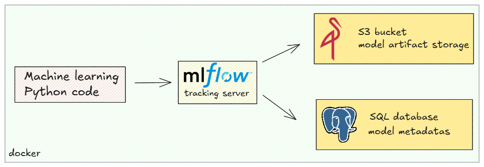
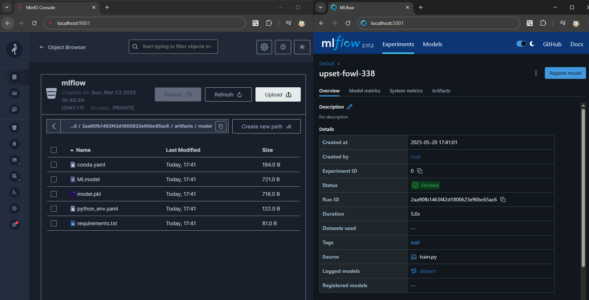

# MLflow basic setup with MinIO and PostgreSQL

This repository contains a Docker-based MLflow setup with Minio for artifact storage, Postgres for backend storage, and a training script. 

## Directory Structure
- `docker/`: Docker configurations for MLflow, Minio, and Postgres.
- `src/`: Training script and dependencies.

## Prerequisites
- Docker Desktop for Windows

## Configure environment variables

The `.env` can be configured based on the below struture and place it in `mflow-setup/docker` folder, alongside with `docker-compose.yml` file.

note: you can change it later to suit your need

```bash
# PostgreSQL
POSTGRES_USER=postgres
POSTGRES_PASSWORD=postgres
POSTGRES_DB=postgres

# MinIO
MINIO_ACCESS_KEY=minioadmin
MINIO_SECRET_ACCESS_KEY=minioadmin
MLFLOW_S3_ENDPOINT=http://minio:9000
```

# Snapshot
If the setup goes well, you can work with 
- Mflow tracking server at [http://localhost:5001](http://localhost:5001)
- MinIO Console UI: [http://localhost:9001](http://localhost:9001)


